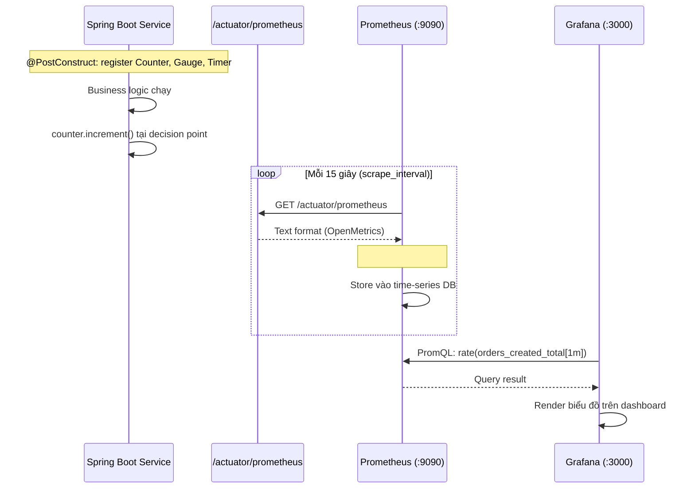
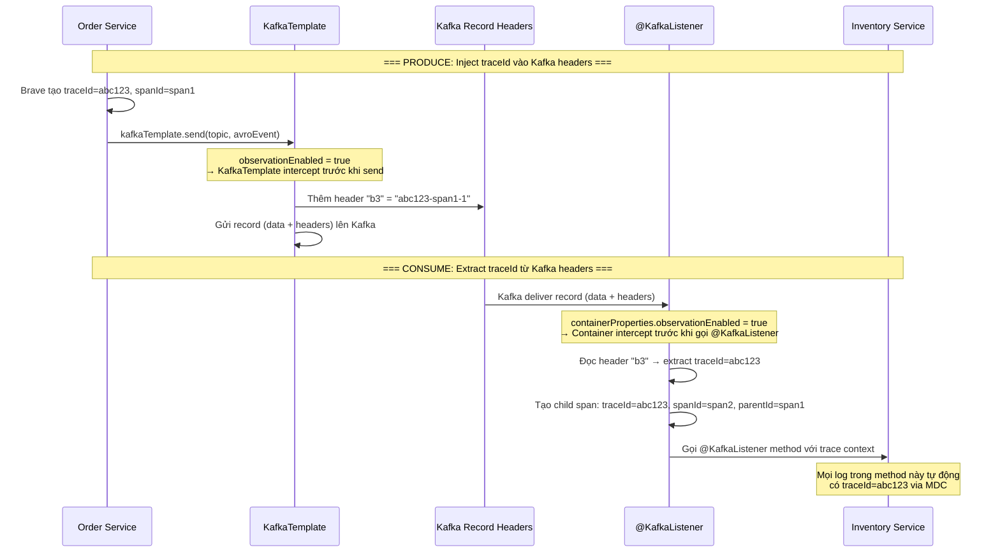
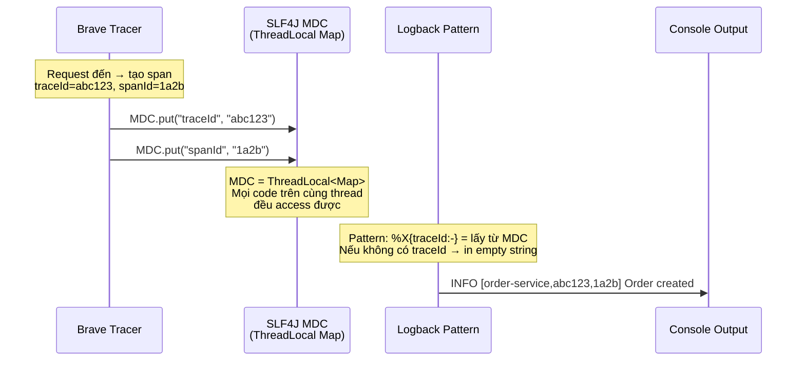
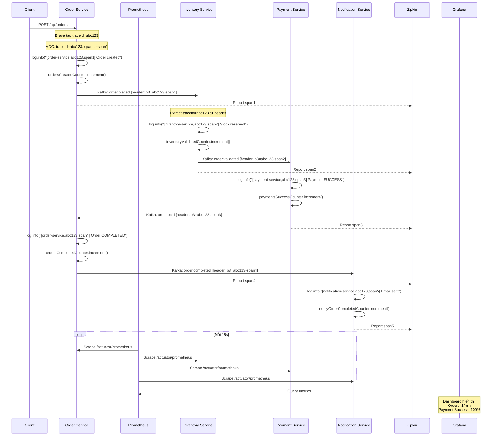

# Step 9: Observability — Metrics, Tracing, Logging

## Vấn đề: "Hệ thống chạy, nhưng ta không biết chuyện gì đang xảy ra"

Sau Step 1–8, hệ thống đã có:
- 4 microservices giao tiếp qua Kafka (Avro + Schema Registry)
- Saga Choreography với compensation (payment.failed → release stock)
- Idempotency (ProcessedEvent), Dead Letter Queue, 59 unit tests

**Nhưng khi chạy production, ta không trả lời được những câu hỏi quan trọng:**

| Câu hỏi | Không có Observability | Có Observability |
|----------|----------------------|------------------|
| Bao nhiêu order được tạo mỗi phút? | Đếm thủ công trong DB | Counter `orders.created.total` → Grafana dashboard |
| Payment success rate là bao nhiêu? | Query DB rồi tính tay | `payments.success / (success + failed) * 100` → Grafana gauge |
| Order bị stuck ở bước nào? | Grep logs 4 services | Zipkin trace tree: thấy ngay service nào chậm/lỗi |
| Log service A liên quan gì đến log service B? | Không liên quan được | Cùng `traceId` → grep 1 lần ra toàn bộ journey |
| Inventory reject nhiều không? Compensation chạy đúng không? | Không biết | Counter `inventory.rejected.total`, `inventory.compensated.total` |

**Observability không phải "nice to have" — nó là yêu cầu bắt buộc cho distributed systems.**

Trong monolith, 1 request = 1 thread = 1 stack trace. Dễ debug.
Trong microservices, 1 request = 4 services × N Kafka messages × N DB transactions. Không có observability = mù.

## 3 Pillars of Observability

```
┌─────────────────────────────────────────────────────────────────┐
│                     Observability Stack                         │
│                                                                 │
│  ┌─────────────────┐  ┌──────────────────┐  ┌───────────────┐ │
│  │    METRICS       │  │    TRACING        │  │   LOGGING     │ │
│  │                  │  │                   │  │               │ │
│  │  "WHAT happened" │  │  "WHERE happened" │  │ "WHY happened"│ │
│  │                  │  │                   │  │               │ │
│  │  Counters,       │  │  Request path     │  │  Detailed     │ │
│  │  Gauges,         │  │  across services, │  │  context at   │ │
│  │  Histograms      │  │  latency per hop  │  │  each step    │ │
│  │                  │  │                   │  │               │ │
│  │  Micrometer      │  │  Micrometer       │  │  SLF4J +      │ │
│  │  → Prometheus    │  │  Tracing (Brave)  │  │  Logback      │ │
│  │  → Grafana       │  │  → Zipkin         │  │  + MDC        │ │
│  └─────────────────┘  └──────────────────┘  └───────────────┘ │
└─────────────────────────────────────────────────────────────────┘
```

### WHY 3 pillars, không phải 1?

- **Metrics** cho biết overview: "có 500 orders/phút, payment fail rate = 15%"
  → Nhưng không biết order cụ thể nào fail, tại sao.
- **Tracing** cho biết path: "order abc đi qua 4 services, bị stuck ở Payment Service 3 giây"
  → Nhưng không biết Payment Service đang làm gì trong 3 giây đó.
- **Logging** cho biết chi tiết: "Payment Service: amount 15000 exceeds limit 10000"
  → Nhưng không biết log này thuộc order nào nếu không có traceId.

**3 pillars bổ sung nhau:** Metrics phát hiện vấn đề → Tracing tìm root cause → Logging xem chi tiết.

---

## Pillar 1: Metrics (Micrometer → Prometheus → Grafana)

### WHY Micrometer?

- **Facade pattern**: giống SLF4J cho logging — code một lần, chọn backend sau (Prometheus, Datadog, CloudWatch...).
- **Tích hợp sẵn** với Spring Boot Actuator — JVM metrics, HTTP metrics, Kafka metrics tự động.
- **Counter, Gauge, Timer, DistributionSummary** — đủ loại metric cho mọi use case.
- **Spring Boot 3.x** đã include Micrometer core — chỉ cần thêm registry adapter.

### WHY Prometheus + Grafana?

| Lựa chọn | Ưu điểm | Nhược điểm |
|-----------|---------|------------|
| **Prometheus** | Open-source, pull-based, PromQL mạnh, standard cho K8s | Không có built-in dashboards |
| **Grafana** | Rich visualization, hỗ trợ nhiều datasource, community dashboards | Cần Prometheus làm backend |
| Datadog | SaaS, all-in-one | Tốn tiền, vendor lock-in |
| CloudWatch | AWS native | Chỉ dùng được trên AWS |

**Pull-based (Prometheus) vs Push-based (Datadog)?**
- Pull: Prometheus chủ động scrape service → service không cần biết Prometheus ở đâu.
- Push: Service phải gửi metrics về server → coupling chặt hơn.
- Pull phù hợp hơn cho container/K8s: service lên/xuống, Prometheus tự discover.

### Architecture



### Custom Business Metrics — Đặt ở đâu, tại sao?

Mỗi metric được đặt tại **business decision point** — nơi service đưa ra quyết định kinh doanh:

```
OrderService:
  createOrder()       → ordersCreatedCounter.increment()      // sau khi publish order.placed
  completeOrder()     → ordersCompletedCounter.increment()    // sau khi publish order.completed
  failOrder()         → ordersFailedCounter.increment()       // sau khi update status FAILED
  handlePaymentFailure() → ordersPaymentFailedCounter.increment()

InventoryService:
  processOrderPlaced()    → inventoryValidatedCounter.increment()   // stock đủ → reserved
                          → inventoryRejectedCounter.increment()    // stock thiếu → rejected
  compensateReservation() → inventoryCompensatedCounter.increment() // payment failed → release

PaymentService:
  processOrderValidated() → paymentsSuccessCounter.increment()  // amount <= 10000
                           → paymentsFailedCounter.increment()  // amount > 10000

NotificationService:
  notifyOrderCompleted() → notifyOrderCompletedCounter.increment()
  notifyOrderFailed()    → notifyOrderFailedCounter.increment()
  notifyPaymentFailed()  → notifyPaymentFailedCounter.increment()
```

**WHY Counter thay vì Gauge?**
- Counter: **chỉ tăng**, dùng cho events (orders created, payments processed).
  → `rate(counter[1m])` cho throughput per minute.
- Gauge: **tăng giảm**, dùng cho current state (active connections, queue size).
  → Không phù hợp cho business events vì events là discrete, không phải state.

### Implementation Pattern

```java
// 1. Inject MeterRegistry (auto-provided bởi Spring Boot Actuator)
@RequiredArgsConstructor
public class OrderService {
    private final MeterRegistry meterRegistry;

    // 2. Register counters trong @PostConstruct (sau khi DI hoàn thành)
    private Counter ordersCreatedCounter;

    @PostConstruct
    void initMetrics() {
        ordersCreatedCounter = Counter.builder("orders.created.total")
                .description("Total orders created")
                .register(meterRegistry);
    }

    // 3. Increment tại business decision point
    public Order createOrder(OrderCreateRequest request) {
        // ... business logic ...
        kafkaProducer.sendOrderPlaced(event);
        ordersCreatedCounter.increment();   // ← SAU khi publish thành công
        return savedOrder;
    }
}
```

**WHY @PostConstruct thay vì register trong constructor?**
- Constructor: `meterRegistry` có thể chưa fully initialized (dependency injection order).
- `@PostConstruct`: chạy SAU khi tất cả dependencies đã inject xong → an toàn.

**WHY field Counter thay vì inline `meterRegistry.counter("...")`?**
- `Counter.builder().register()` idempotent — gọi lại trả về cùng instance.
- Nhưng giữ reference giảm overhead lookup mỗi lần increment.

### Prometheus Scrape Config

```yaml
# infra/prometheus/prometheus.yml
global:
  scrape_interval: 15s       # Mỗi 15s scrape 1 lần — balance giữa freshness và load

scrape_configs:
  - job_name: 'order-service'
    metrics_path: /actuator/prometheus   # Spring Boot Actuator endpoint
    static_configs:
      - targets: ['host.docker.internal:8081']  # Services chạy trên host, Prometheus trong Docker
```

**WHY `host.docker.internal`?**
- Prometheus chạy trong Docker container.
- Spring Boot services chạy trên host machine (via `./mvnw spring-boot:run`).
- `host.docker.internal` là DNS đặc biệt của Docker → resolve thành host IP.
- Trong production (K8s): dùng Service Discovery thay vì static targets.

### Grafana Dashboard

Pre-built dashboard (`infra/grafana/provisioning/dashboards/spring-boot-kafka.json`) với 8 panels:

| Panel | Type | PromQL | Mục đích |
|-------|------|--------|----------|
| Orders Created | TimeSeries | `rate(orders_created_total[1m]) * 60` | Throughput đơn hàng |
| Orders Completed vs Failed | TimeSeries | `rate(orders_completed_total[1m])` | So sánh success/failure |
| Payment Success Rate | Gauge | `success / (success + failed) * 100` | Health indicator |
| Inventory Validated vs Rejected | TimeSeries | `rate(inventory_*_total[1m])` | Stock availability |
| Payments Rate | TimeSeries | `rate(payments_*_total[1m])` | Payment throughput |
| Notifications Sent | TimeSeries | `rate(notifications_*_total[1m])` | Notification volume |
| JVM Memory Used | TimeSeries | `jvm_memory_used_bytes{area="heap"}` | Memory pressure |
| HTTP Request Duration p99 | TimeSeries | `histogram_quantile(0.99, ...)` | API latency |

---

## Pillar 2: Distributed Tracing (Micrometer Tracing + Brave → Zipkin)

### Vấn đề: "Request đi qua 4 services — làm sao biết nó ở đâu?"

```
Trước khi có Tracing:

  Client → Order Service → (Kafka) → Inventory Service → (Kafka) → Payment Service
                                                                  → (Kafka) → Order Service
                                                                              → (Kafka) → Notification Service

  Nếu order bị stuck → grep logs 4 services → tìm orderId → ghép thủ công → mất 30 phút.

Sau khi có Tracing:

  Zipkin UI: search traceId → thấy ngay full journey, latency per hop, errors.
  Mất 10 giây.
```

### WHY Micrometer Tracing + Brave?

| Lựa chọn | Ưu điểm | Nhược điểm |
|-----------|---------|------------|
| **Micrometer Tracing** | Spring Boot native, facade pattern (như metrics) | Cần bridge library |
| **Brave** (bridge) | Mature, battle-tested tracer | - |
| **OpenTelemetry** (bridge) | CNCF standard, newer | Heavier, more complex setup |
| Spring Cloud Sleuth | Popular legacy choice | Deprecated, replaced by Micrometer Tracing |

**WHY Brave thay vì OpenTelemetry?**
- Brave nhẹ hơn, ít dependencies hơn.
- Zipkin + Brave là combo ổn định nhất cho học tập.
- OpenTelemetry phù hợp hơn khi cần multi-signal (metrics + traces + logs trong 1 SDK).
- Chuyển sang OpenTelemetry sau chỉ cần swap bridge: `micrometer-tracing-bridge-brave` → `micrometer-tracing-bridge-otel`.

### WHY Zipkin?

| Lựa chọn | Ưu điểm | Nhược điểm |
|-----------|---------|------------|
| **Zipkin** | Lightweight, in-memory storage, đủ cho dev/learning | Không có alerting |
| Jaeger | CNCF standard, K8s friendly | Phức tạp hơn để setup |
| Tempo (Grafana) | Tích hợp sẵn Grafana | Cần S3/GCS backend |

### Trace Concepts

```
Trace = toàn bộ journey của 1 request qua hệ thống
  │
  ├── Span A: Order Service nhận HTTP request (root span)
  │     traceId=abc123, spanId=span1, parentId=null
  │
  ├── Span B: Order Service publish order.placed (child span)
  │     traceId=abc123, spanId=span2, parentId=span1
  │
  ├── Span C: Inventory Service consume order.placed
  │     traceId=abc123, spanId=span3, parentId=span2
  │
  ├── Span D: Inventory Service publish order.validated
  │     traceId=abc123, spanId=span4, parentId=span3
  │
  ├── Span E: Payment Service consume order.validated
  │     traceId=abc123, spanId=span5, parentId=span4
  │
  └── ... tiếp tục qua Order Service, Notification Service
```

**traceId**: ID duy nhất cho toàn bộ request journey. Tất cả spans share cùng traceId.
**spanId**: ID duy nhất cho 1 operation trong 1 service.
**parentId**: Link span con với span cha → tạo thành cây (tree).

### Kafka Trace Propagation — Điểm quan trọng nhất

Trong HTTP-based microservices, traceId tự động truyền qua HTTP headers.
Nhưng Kafka là **asynchronous** — không có HTTP headers. Cần cơ chế riêng.



**WHY cần enable observation ở CẢ 2 nơi (application.yml + Java config)?**

```yaml
# application.yml — Spring Boot auto-configuration
spring.kafka.listener.observation-enabled: true
spring.kafka.template.observation-enabled: true
```

```java
// KafkaProducerConfig.java — Manual bean configuration
template.setObservationEnabled(true);

// KafkaConsumerConfig.java — Manual bean configuration
factory.getContainerProperties().setObservationEnabled(true);
```

→ Vì ta dùng **manual config** (`@Bean KafkaTemplate`, `@Bean ConcurrentKafkaListenerContainerFactory`).
→ Auto-configuration của Spring Boot bị override bởi manual beans.
→ Phải set observation trong cả `application.yml` (cho auto-config fallback) VÀ Java config (cho manual beans).

### Zipkin Configuration

```yaml
# application.yml
management:
  zipkin:
    tracing:
      endpoint: http://localhost:9411/api/v2/spans   # Zipkin HTTP collector
  tracing:
    sampling:
      probability: 1.0   # 100% sampling — trace MỌI request
```

**WHY sampling probability = 1.0?**
- Dev/learning: cần thấy TẤT CẢ traces để verify flow.
- Production: giảm xuống 0.1 (10%) hoặc 0.01 (1%) để giảm overhead + storage.
- Sampling quyết định ở root span — nếu root span được sample, tất cả child spans cũng được sample.

---

## Pillar 3: Structured Logging (Logback + MDC)

### Vấn đề: Logs từ 4 services trộn lẫn

```
# TRƯỚC: Không có traceId — không biết log nào thuộc request nào
INFO  Order created | orderId=abc
INFO  Processing order.placed | orderId=abc
INFO  Stock reserved | orderId=abc
INFO  Processing payment | orderId=abc
ERROR Payment FAILED | orderId=abc
INFO  Compensating reservation | orderId=abc
INFO  Order PAYMENT_FAILED | orderId=abc

# Nếu có 100 requests đồng thời? Logs trộn lẫn, grep orderId ra 10 dòng
# nhưng không biết thứ tự, không biết dòng nào thuộc request nào.
```

```
# SAU: Có traceId — grep 1 lần ra toàn bộ journey
INFO [order-service,abc123def456,1a2b3c4d] Order created | orderId=abc
INFO [inventory-service,abc123def456,5e6f7g8h] Processing order.placed | orderId=abc
INFO [inventory-service,abc123def456,5e6f7g8h] Stock reserved | orderId=abc
INFO [payment-service,abc123def456,9i0j1k2l] Processing payment | orderId=abc
ERROR [payment-service,abc123def456,9i0j1k2l] Payment FAILED | orderId=abc
INFO [inventory-service,abc123def456,3m4n5o6p] Compensating reservation | orderId=abc
INFO [order-service,abc123def456,7q8r9s0t] Order PAYMENT_FAILED | orderId=abc

# grep "abc123def456" trên tất cả service logs → ra đúng 7 dòng, đúng thứ tự
```

### HOW: MDC (Mapped Diagnostic Context)



### Log Pattern Configuration

```yaml
# application.yml
logging:
  pattern:
    level: "%5p [${spring.application.name:},%X{traceId:-},%X{spanId:-}]"
```

Giải thích pattern:
- `%5p` — log level, right-padded 5 chars (`INFO `, `ERROR`, `WARN `)
- `${spring.application.name:}` — tên service từ config
- `%X{traceId:-}` — traceId từ MDC, nếu không có thì empty string
- `%X{spanId:-}` — spanId từ MDC

**WHY dùng `%X{traceId:-}` thay vì `%X{traceId}`?**
- `%X{traceId}` — nếu traceId không có trong MDC → in `null`
- `%X{traceId:-}` — nếu traceId không có → in empty string (cleaner)

---

## Files Changed — Tổng quan

### Dependencies (POM files)

| File | Thay đổi | Mục đích |
|------|----------|----------|
| `pom.xml` (parent) | Thêm `zipkin-reporter.version`, `dependencyManagement` | Version management tập trung |
| `order-service/pom.xml` | Thêm 3 dependencies | Prometheus, Brave, Zipkin |
| `inventory-service/pom.xml` | Thêm 3 dependencies | Prometheus, Brave, Zipkin |
| `payment-service/pom.xml` | Thêm 3 dependencies | Prometheus, Brave, Zipkin |
| `notification-service/pom.xml` | Thêm 3 dependencies | Prometheus, Brave, Zipkin |

### Application Config

| File | Thay đổi | Mục đích |
|------|----------|----------|
| 4x `application.yml` | `prometheus` endpoint, zipkin URL, sampling, kafka observation, log pattern | Enable 3 pillars |

### Kafka Config (Java)

| File | Thay đổi | Mục đích |
|------|----------|----------|
| 4x `KafkaProducerConfig.java` | `template.setObservationEnabled(true)` | Inject traceId vào Kafka headers |
| 4x `KafkaConsumerConfig.java` | `factory.getContainerProperties().setObservationEnabled(true)` | Extract traceId từ Kafka headers |

### Business Metrics

| File | Thay đổi | Mục đích |
|------|----------|----------|
| `OrderService.java` | `MeterRegistry` + 4 counters + `@PostConstruct` | Track order lifecycle |
| `InventoryService.java` | `MeterRegistry` + 3 counters + `@PostConstruct` | Track stock operations |
| `PaymentService.java` | `MeterRegistry` + 2 counters + `@PostConstruct` | Track payment outcomes |
| `NotificationService.java` | `MeterRegistry` + 3 counters + `@PostConstruct` + `@RequiredArgsConstructor` | Track notifications |

### Docker Compose + Infra

| File | Thay đổi | Mục đích |
|------|----------|----------|
| `docker-compose.yml` | Thêm prometheus, grafana, zipkin services | Observability infrastructure |
| `infra/prometheus/prometheus.yml` | Scrape config cho 4 services | Prometheus biết scrape service nào |
| `infra/grafana/provisioning/datasources/datasource.yml` | Auto-provision Prometheus datasource | Grafana tự connect Prometheus |
| `infra/grafana/provisioning/dashboards/dashboard.yml` | Dashboard provider config | Auto-load dashboard JSON |
| `infra/grafana/provisioning/dashboards/spring-boot-kafka.json` | Pre-built dashboard (8 panels) | Visualize metrics ngay lập tức |

### Test Fixes

| File | Thay đổi | Mục đích |
|------|----------|----------|
| `OrderServiceTest.java` | `@Spy MeterRegistry` + `@BeforeEach initMetrics()` | Inject MeterRegistry cho @InjectMocks |
| `InventoryServiceTest.java` | `@Spy MeterRegistry` + `@BeforeEach initMetrics()` | Inject MeterRegistry cho @InjectMocks |
| `PaymentServiceTest.java` | `@Spy MeterRegistry` + `@BeforeEach initMetrics()` | Inject MeterRegistry cho @InjectMocks |
| `NotificationServiceTest.java` | `new SimpleMeterRegistry()` + `initMetrics()` | NotificationService tạo thủ công |

**WHY @Spy thay vì @Mock cho MeterRegistry?**
- `@Mock`: tất cả methods return null/0/false → `Counter.builder().register()` return null → NPE.
- `@Spy`: wrap real object → methods chạy thật → counters register và increment OK.
- `SimpleMeterRegistry` là in-memory implementation → nhẹ, không cần Prometheus.

**WHY @BeforeEach initMetrics()?**
- `@PostConstruct` là Spring lifecycle callback — chỉ chạy trong Spring context.
- Mockito (`@InjectMocks`) chỉ call constructor, KHÔNG call `@PostConstruct`.
- Phải gọi `initMetrics()` thủ công trong test setup.

---

## End-to-End Observability Flow



---

## Infrastructure

### Docker Compose — 3 Services mới

```yaml
# Prometheus — metrics database
prometheus:
  image: prom/prometheus:v2.51.0
  ports: ["9090:9090"]
  volumes:
    - ./infra/prometheus/prometheus.yml:/etc/prometheus/prometheus.yml
  extra_hosts:
    - "host.docker.internal:host-gateway"   # để Prometheus reach services trên host

# Grafana — dashboard UI
grafana:
  image: grafana/grafana:10.4.0
  ports: ["3000:3000"]                       # http://localhost:3000 (admin/admin)
  volumes:
    - ./infra/grafana/provisioning:/etc/grafana/provisioning   # auto-provision datasource + dashboard

# Zipkin — trace visualization
zipkin:
  image: openzipkin/zipkin:3.4
  ports: ["9411:9411"]                       # http://localhost:9411
```

### Ports Summary

| Service | Port | URL | Mục đích |
|---------|------|-----|----------|
| Prometheus | 9090 | http://localhost:9090 | Metrics query + targets status |
| Grafana | 3000 | http://localhost:3000 | Dashboard (login: admin/admin) |
| Zipkin | 9411 | http://localhost:9411 | Distributed trace viewer |

---

## Verification

### 1. Build & Test

```bash
# Tất cả 59 tests phải pass
./mvnw clean test

# Build thành công
./mvnw clean install -DskipTests
```

### 2. Start Infrastructure

```bash
docker compose up -d
docker compose ps    # prometheus, grafana, zipkin phải running
```

### 3. Check Prometheus Metrics

```bash
# Start services
./mvnw spring-boot:run -pl order-service

# Prometheus endpoint phải trả về metrics
curl http://localhost:8081/actuator/prometheus | grep orders_created
# Kết quả: orders_created_total 0.0

# Tạo 1 order
curl -X POST http://localhost:8081/api/orders ...

# Check lại
curl http://localhost:8081/actuator/prometheus | grep orders_created
# Kết quả: orders_created_total 1.0
```

### 4. Check Prometheus Targets

Mở http://localhost:9090/targets → tất cả 4 services phải hiện **UP** (xanh).

### 5. Check Grafana Dashboard

Mở http://localhost:3000 → login admin/admin → Dashboard "Spring Boot Kafka Pipeline" → thấy biểu đồ.

### 6. Check Zipkin Traces

Mở http://localhost:9411 → "Run Query" → click vào trace → thấy spans từ tất cả services với cùng traceId.

### 7. Check Correlated Logs

```bash
# Xem log output — traceId/spanId phải xuất hiện
# INFO [order-service,6a3d8f2b1c4e5a7b,9f8e7d6c5b4a3210] Order created | orderId=...

# Grep traceId across all services
grep "6a3d8f2b1c4e5a7b" order-service.log inventory-service.log payment-service.log notification-service.log
# → Ra tất cả logs cho cùng 1 request
```

---

## Key Concepts Learned

| Concept | Mô tả |
|---------|-------|
| Observability | Khả năng hiểu internal state của hệ thống từ external outputs (metrics, traces, logs) |
| Micrometer | Metrics facade cho JVM applications — code 1 lần, chọn backend sau |
| Counter | Metric chỉ tăng — dùng cho discrete events (orders, payments) |
| Gauge | Metric tăng giảm — dùng cho current state (active connections, memory) |
| MeterRegistry | Central registry quản lý tất cả metrics — inject via Spring DI |
| Prometheus | Time-series database, pull-based, scrape metrics từ HTTP endpoints |
| PromQL | Prometheus Query Language — `rate()`, `sum()`, `histogram_quantile()` |
| Grafana | Visualization platform — connect multiple datasources, rich dashboards |
| Distributed Tracing | Theo dõi 1 request xuyên suốt nhiều services |
| TraceId | ID duy nhất cho toàn bộ request journey — shared bởi tất cả spans |
| SpanId | ID duy nhất cho 1 operation trong 1 service |
| Brave | Distributed tracing instrumentation library (Zipkin ecosystem) |
| Zipkin | Distributed tracing system — collect, store, visualize traces |
| MDC | Mapped Diagnostic Context — ThreadLocal map cho logging context |
| Kafka Observation | Spring Kafka 3.x feature — propagate trace context qua Kafka record headers |
| Sampling Probability | % requests được trace — 1.0 cho dev, 0.01-0.1 cho production |
| Pull vs Push Metrics | Pull (Prometheus): server scrape service. Push (Datadog): service gửi về server |

---

## Trade-offs & Limitations

| Quyết định | Trade-off | Production consideration |
|------------|-----------|------------------------|
| Sampling = 1.0 | Trace 100% → overhead CPU/network | Giảm xuống 0.01-0.1 trong production |
| In-memory Zipkin | Mất traces khi restart | Production: dùng Elasticsearch/Cassandra backend |
| Static scrape targets | Phải thêm target thủ công | Production: dùng service discovery (K8s, Consul) |
| Counter only | Không có latency distribution | Thêm Timer/Histogram nếu cần p50/p99 tracking |
| Console logging | Logs chỉ ra stdout | Production: ship logs sang ELK/Loki |
| Grafana admin/admin | Insecure default password | Production: đổi password, dùng OAuth |
