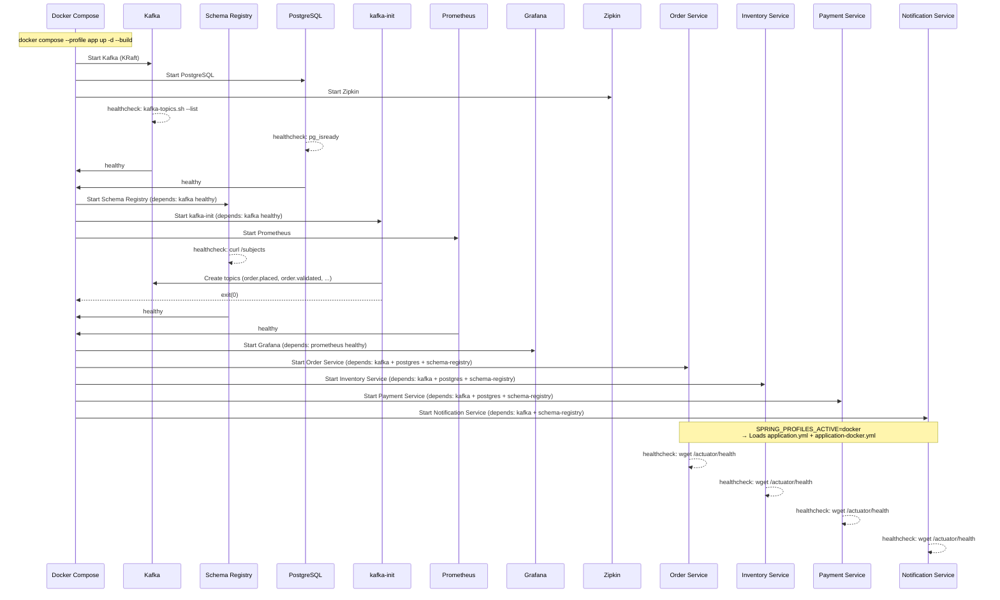
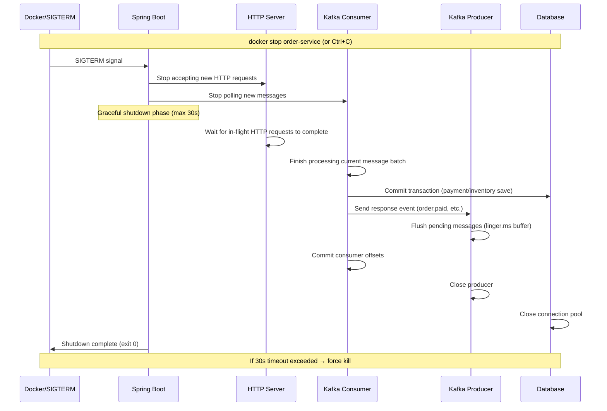
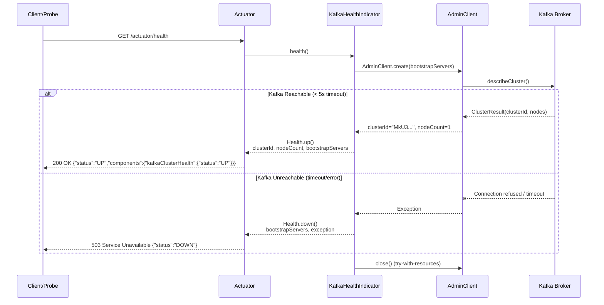
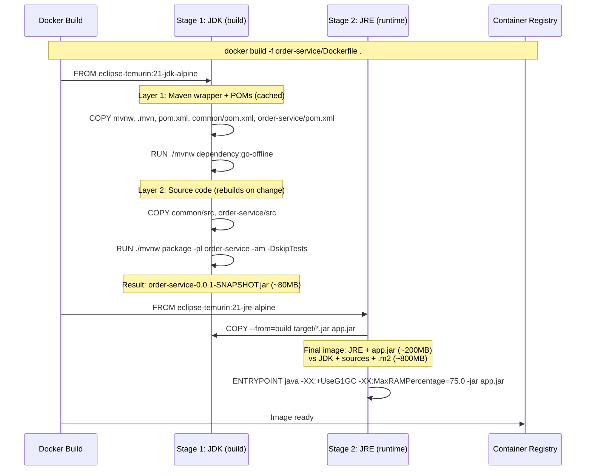
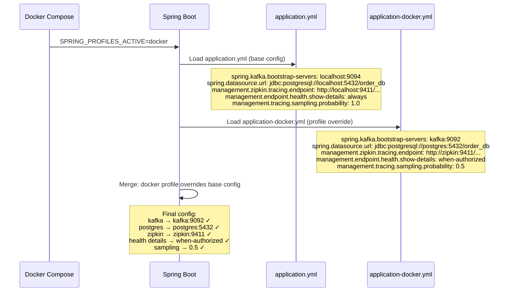

# Step 10: Production Hardening — Sequence Diagrams

## 1. Docker Compose Startup (Full Mode)

## 2. Graceful Shutdown Flow

## 3. Kafka Health Check Flow

## 4. Multi-stage Docker Build

## 5. Spring Profile Resolution (Docker Mode)

