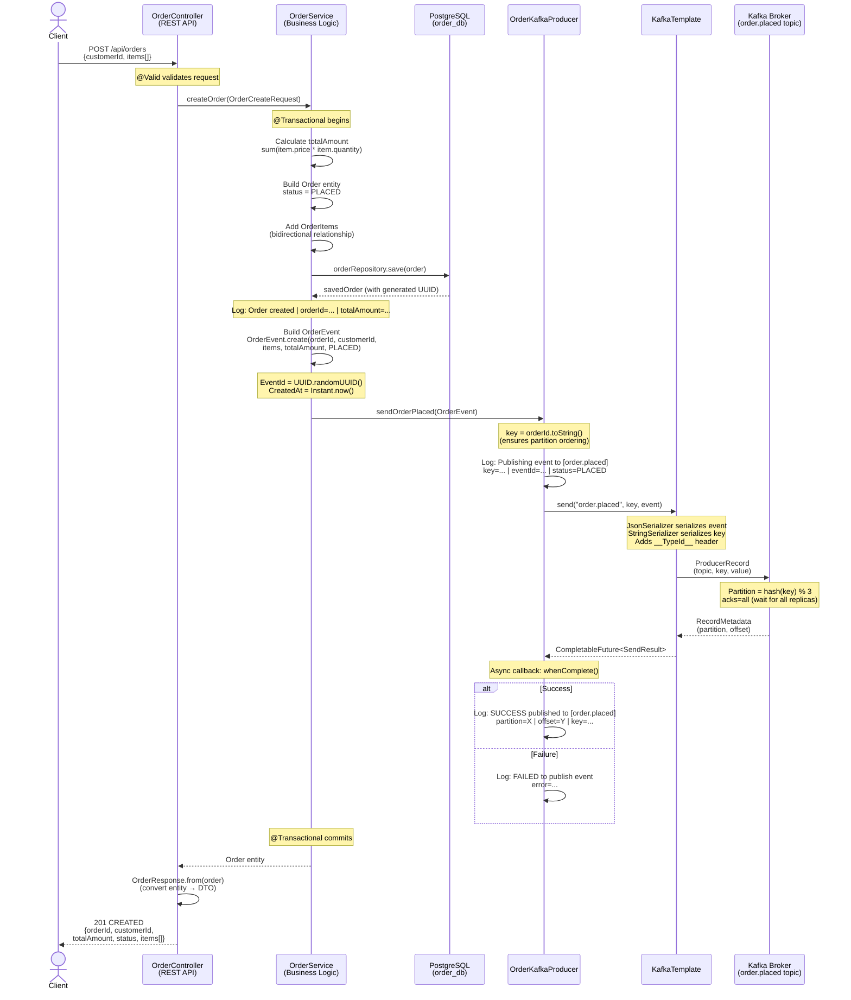
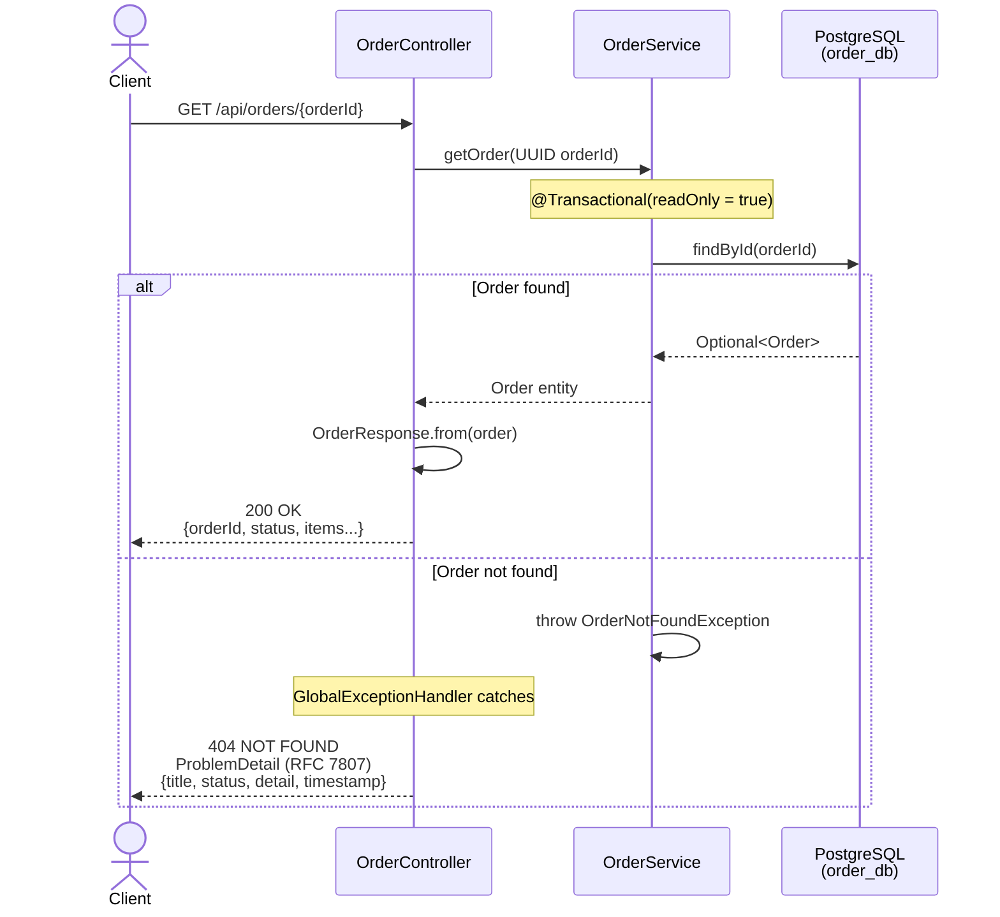
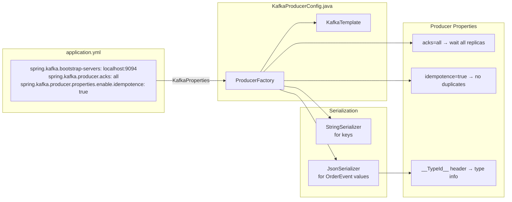
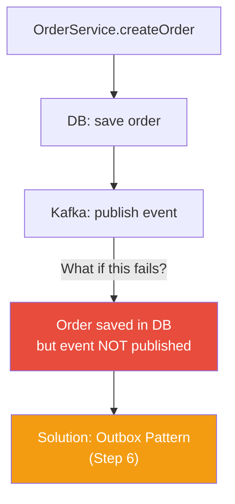

# Step 2: Order Service - Producer Fundamentals — Sequence Diagram

## Mermaid Sequence Diagram

Paste the diagram below into [mermaid.live](https://mermaid.live) or any Mermaid-compatible viewer to visualize.

### Create Order Flow (Happy Path)



### Get Order by ID Flow



### Component Architecture (Step 2)

```mermaid
graph TB
    subgraph "Client"
        REST[HTTP Client / cURL]
    end

    subgraph "order-service (port 8081)"
        subgraph "Controller Layer"
            OC[OrderController<br/>@RestController]
            GEH[GlobalExceptionHandler<br/>@RestControllerAdvice]
        end

        subgraph "Service Layer"
            OS[OrderService<br/>@Service @Transactional]
        end

        subgraph "Domain Layer"
            OR[Order<br/>@Entity]
            OI[OrderItem<br/>@Entity]
            REPO[OrderRepository<br/>JpaRepository]
        end

        subgraph "Kafka Layer"
            PROD[OrderKafkaProducer<br/>@Component]
            CFG[KafkaProducerConfig<br/>@Configuration]
            KT[KafkaTemplate<br/>String, OrderEvent]
        end
    end

    subgraph "common module"
        OE[OrderEvent<br/>record]
        OSTAT[OrderStatus<br/>enum]
        KTOPICS[KafkaTopics<br/>constants]
        DTO[OrderCreateRequest<br/>record]
    end

    subgraph "Infrastructure (Docker)"
        PG[(PostgreSQL<br/>order_db)]
        KAFKA[Kafka Broker<br/>order.placed topic<br/>3 partitions]
        KUI[Kafka UI<br/>:8088]
    end

    REST -->|POST/GET| OC
    OC --> OS
    OS --> REPO
    REPO --> PG
    OR --> OI
    OS --> PROD
    PROD --> KT
    CFG --> KT
    KT -->|"key=orderId<br/>value=OrderEvent (JSON)"| KAFKA
    KAFKA -.-> KUI

    OS -.-> OE
    OS -.-> OSTAT
    OC -.-> DTO
    PROD -.-> KTOPICS

    style KAFKA fill:#e74c3c,color:#fff
    style PG fill:#336791,color:#fff
    style KUI fill:#2ecc71,color:#fff
```

### Kafka Producer Configuration



## Key Concepts in Step 2

| Concept | Where | Why |
|---------|-------|-----|
| **KafkaTemplate** | `KafkaProducerConfig` | Type-safe wrapper for Kafka Producer |
| **Message Key** | `OrderKafkaProducer` (orderId) | Same orderId → same partition → ordering guarantee |
| **CompletableFuture** | `sendOrderPlaced()` | Non-blocking async publish, no thread blocking |
| **acks=all** | `application.yml` | Message durability — all replicas must acknowledge |
| **Idempotent producer** | `application.yml` | Prevents duplicate messages on retry |
| **JsonSerializer** | `KafkaProducerConfig` | Serialize OrderEvent to JSON with type headers |
| **@Transactional** | `OrderService` | DB operations atomic — save + publish in one unit |
| **Record (immutable)** | `OrderEvent`, `OrderCreateRequest` | Events are immutable — never modified after creation |
| **ProblemDetail** | `GlobalExceptionHandler` | RFC 7807 standard error response format |
| **UUID as ID** | `Order` entity | Globally unique, safe for Kafka partition routing |

## Dual-Write Problem (Known Limitation)



Currently, if Kafka publish fails after DB save, the order exists in the database but no event is sent. This is the **dual-write problem** and will be solved with the **Outbox Pattern** in Step 6.
