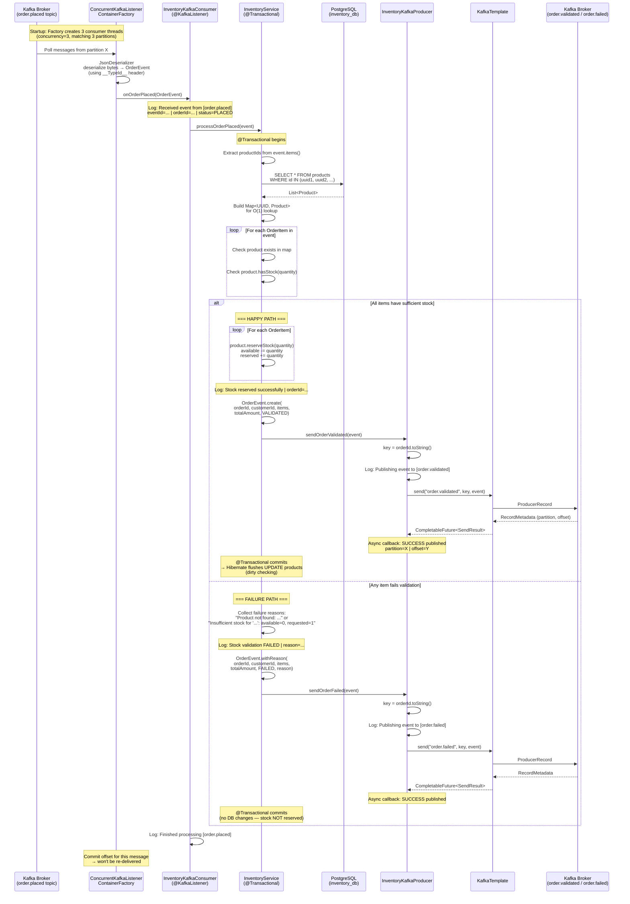
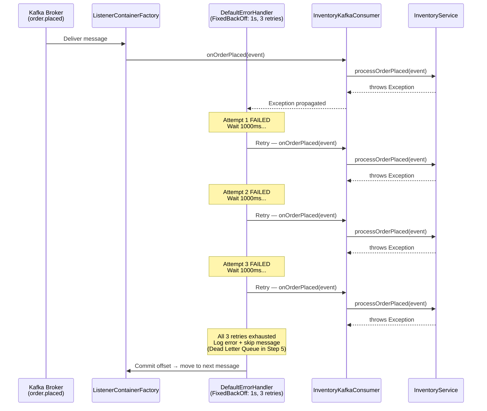
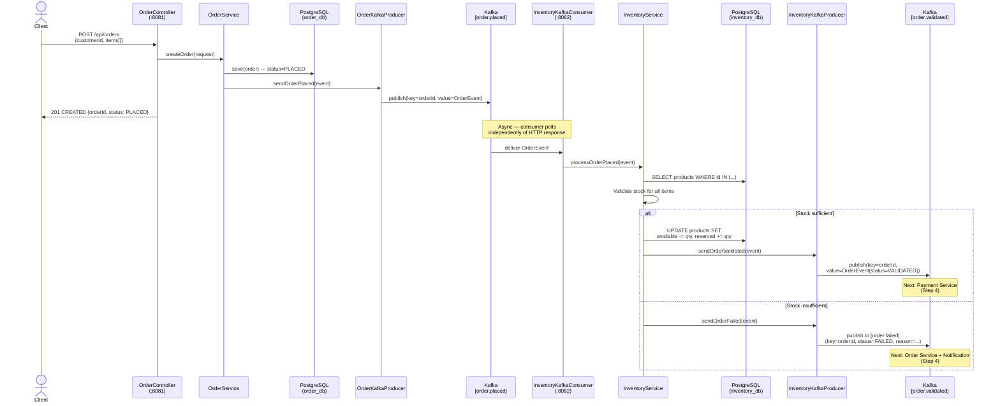
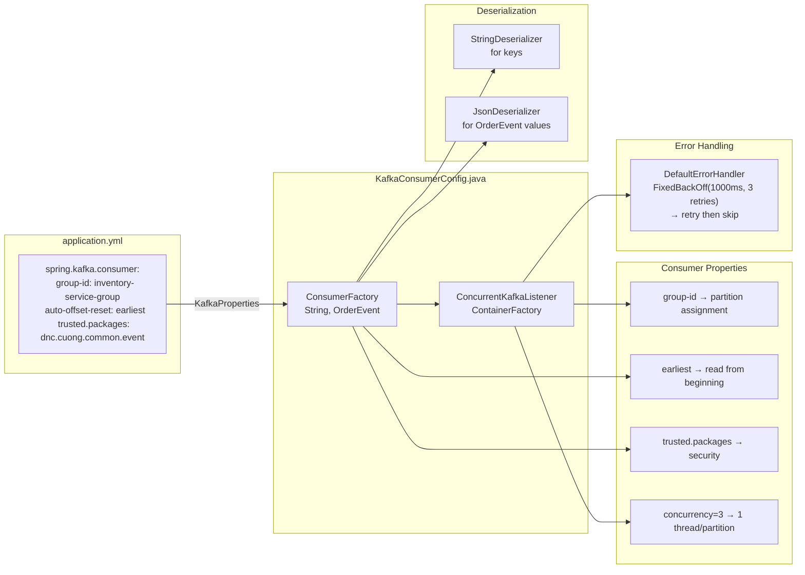

# Step 3: Inventory Service — Consumer Fundamentals — Sequence Diagram

## Mermaid Sequence Diagram

Paste the diagram below into [mermaid.live](https://mermaid.live) or any Mermaid-compatible viewer to visualize.

### Consumer Flow — Stock Validation (Happy Path + Failure Path)



### Error Handling — Consumer Retry Flow



### End-to-End Flow (Order Service → Inventory Service)



### Component Architecture (Step 3)

```mermaid
graph TB
    subgraph "Order Service (:8081)"
        OP[OrderKafkaProducer]
    end

    subgraph "Kafka Broker"
        T1[order.placed<br/>3 partitions]
        T2[order.validated<br/>3 partitions]
        T3[order.failed<br/>3 partitions]
    end

    subgraph "inventory-service (:8082)"
        subgraph "Config Layer"
            CC[KafkaConsumerConfig<br/>ConsumerFactory +<br/>ListenerContainerFactory]
            PC[KafkaProducerConfig<br/>ProducerFactory +<br/>KafkaTemplate]
            DI[DataInitializer<br/>CommandLineRunner]
        end

        subgraph "Kafka Layer"
            IC[InventoryKafkaConsumer<br/>@KafkaListener]
            IP[InventoryKafkaProducer<br/>@Component]
        end

        subgraph "Service Layer"
            IS[InventoryService<br/>@Transactional]
        end

        subgraph "Domain Layer"
            PR[Product<br/>@Entity]
            REPO[ProductRepository<br/>JpaRepository]
        end
    end

    subgraph "Infrastructure"
        PG[(PostgreSQL<br/>inventory_db)]
    end

    OP -->|"publish"| T1
    T1 -->|"consume<br/>@KafkaListener"| IC
    CC -.->|configures| IC
    IC --> IS
    IS --> REPO
    REPO --> PG
    DI -->|"seed data"| REPO
    IS --> IP
    PC -.->|configures| IP
    IP -->|"stock OK"| T2
    IP -->|"stock FAIL"| T3

    style T1 fill:#e74c3c,color:#fff
    style T2 fill:#27ae60,color:#fff
    style T3 fill:#e67e22,color:#fff
    style PG fill:#336791,color:#fff
```

### Kafka Consumer Configuration Detail



## Key Concepts in Step 3

| Concept | Where | Why |
|---------|-------|-----|
| **@KafkaListener** | `InventoryKafkaConsumer` | Declarative message consumption — Spring manages poll loop |
| **Consumer Group** | `inventory-service-group` | Partition assignment, rebalancing, parallel processing |
| **ConsumerFactory** | `KafkaConsumerConfig` | Creates consumer instances with correct deserializer config |
| **ConcurrentKafkaListenerContainerFactory** | `KafkaConsumerConfig` | Manages consumer threads, concurrency, error handling |
| **setConcurrency(3)** | `KafkaConsumerConfig` | Match partition count — 1 thread per partition for max throughput |
| **JsonDeserializer** | `KafkaConsumerConfig` | Deserialize JSON bytes → OrderEvent using __TypeId__ header |
| **TRUSTED_PACKAGES** | `KafkaConsumerConfig` | Security — only allow deserialization of known event classes |
| **DefaultErrorHandler** | `KafkaConsumerConfig` | Retry 3 times with 1s delay, then skip (DLQ in Step 5) |
| **auto-offset-reset: earliest** | `application.yml` | New consumer groups start from beginning (don't miss messages) |
| **Batch lookup** | `findAllByIdIn()` | Single SQL query instead of N+1 for stock validation |
| **Dirty checking** | `InventoryService` | JPA auto-detects entity changes — no explicit save() needed |
| **reserveStock()** | `Product` domain method | Encapsulates business rule in entity (DDD pattern) |
| **Thin consumer** | `InventoryKafkaConsumer` | Only receives + delegates — business logic in service layer |
