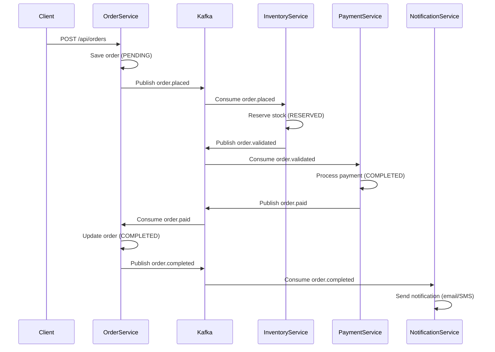
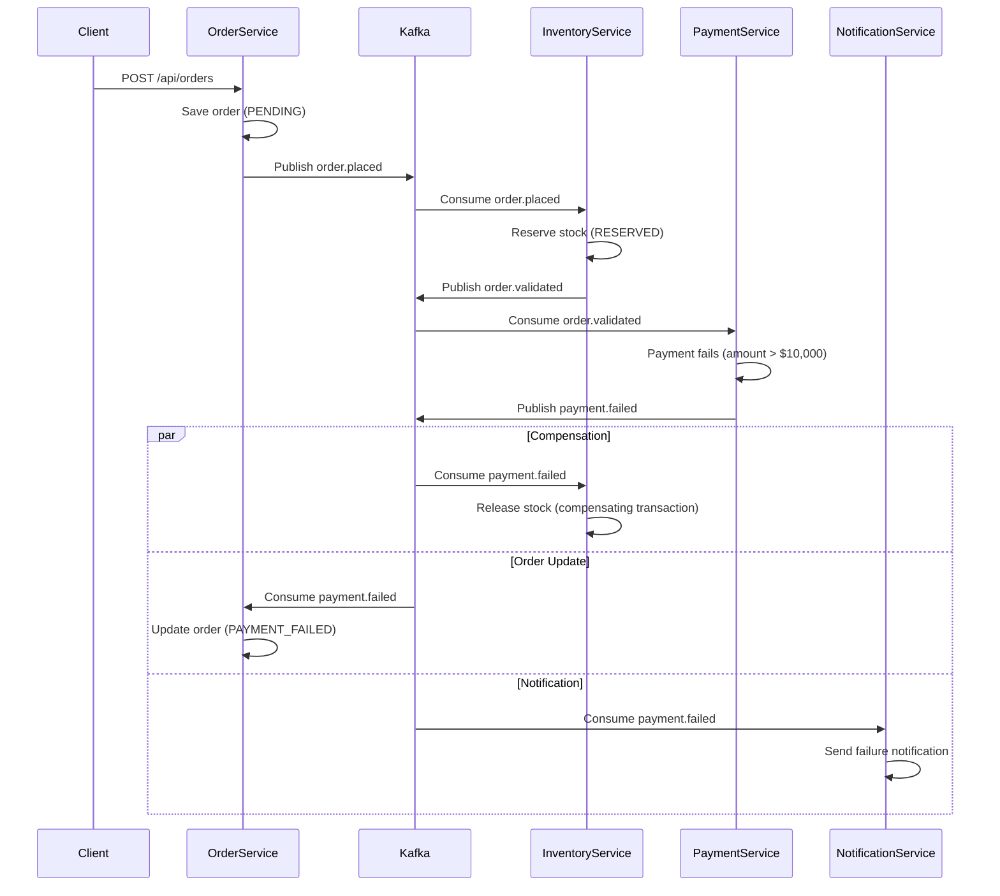
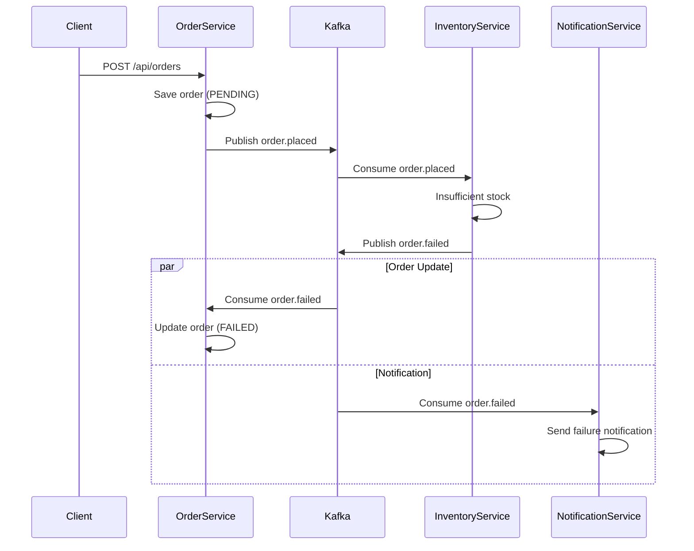

# Step 4: Saga Choreography — Sequence Diagrams

## Happy Path — Order Completed

```mermaid
sequenceDiagram
    participant Client
    participant OrderService
    participant Kafka
    participant InventoryService
    participant PaymentService
    participant NotificationService

    Client->>OrderService: POST /api/orders
    OrderService->>OrderService: Save order (PENDING)
    OrderService->>Kafka: Publish order.placed

    Kafka->>InventoryService: Consume order.placed
    InventoryService->>InventoryService: Reserve stock (RESERVED)
    InventoryService->>Kafka: Publish order.validated

    Kafka->>PaymentService: Consume order.validated
    PaymentService->>PaymentService: Process payment (COMPLETED)
    PaymentService->>Kafka: Publish order.paid

    Kafka->>OrderService: Consume order.paid
    OrderService->>OrderService: Update order (COMPLETED)
    OrderService->>Kafka: Publish order.completed

    Kafka->>NotificationService: Consume order.completed
    NotificationService->>NotificationService: Send notification (email/SMS)
```

## Payment Failure + Compensation

```mermaid
sequenceDiagram
    participant Client
    participant OrderService
    participant Kafka
    participant InventoryService
    participant PaymentService
    participant NotificationService

    Client->>OrderService: POST /api/orders
    OrderService->>OrderService: Save order (PENDING)
    OrderService->>Kafka: Publish order.placed

    Kafka->>InventoryService: Consume order.placed
    InventoryService->>InventoryService: Reserve stock (RESERVED)
    InventoryService->>Kafka: Publish order.validated

    Kafka->>PaymentService: Consume order.validated
    PaymentService->>PaymentService: Payment fails (amount > $10,000)
    PaymentService->>Kafka: Publish payment.failed

    par Compensation
        Kafka->>InventoryService: Consume payment.failed
        InventoryService->>InventoryService: Release stock (compensating transaction)
    and Order Update
        Kafka->>OrderService: Consume payment.failed
        OrderService->>OrderService: Update order (PAYMENT_FAILED)
    and Notification
        Kafka->>NotificationService: Consume payment.failed
        NotificationService->>NotificationService: Send failure notification
    end
```

## Stock Validation Failure

```mermaid
sequenceDiagram
    participant Client
    participant OrderService
    participant Kafka
    participant InventoryService
    participant NotificationService

    Client->>OrderService: POST /api/orders
    OrderService->>OrderService: Save order (PENDING)
    OrderService->>Kafka: Publish order.placed

    Kafka->>InventoryService: Consume order.placed
    InventoryService->>InventoryService: Insufficient stock
    InventoryService->>Kafka: Publish order.failed

    par Order Update
        Kafka->>OrderService: Consume order.failed
        OrderService->>OrderService: Update order (FAILED)
    and Notification
        Kafka->>NotificationService: Consume order.failed
        NotificationService->>NotificationService: Send failure notification
    end
```
