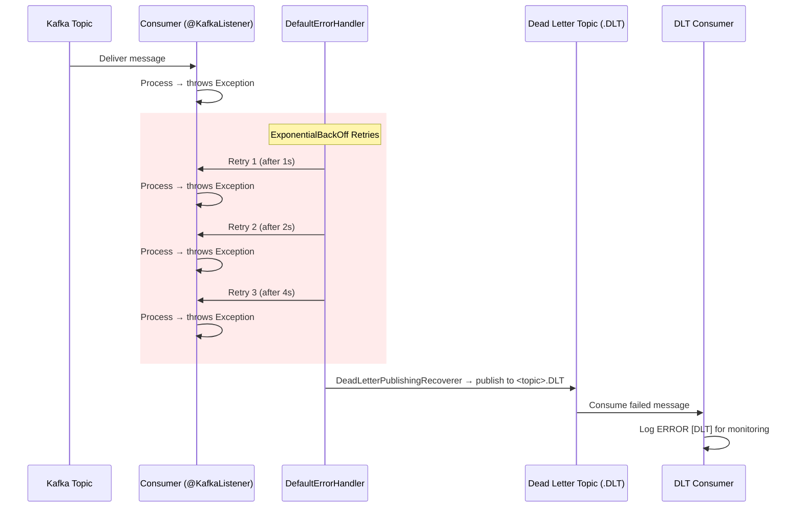
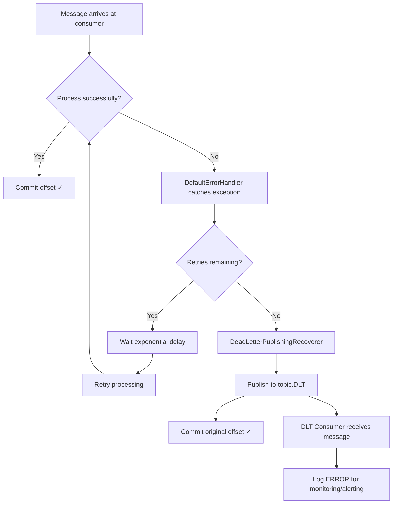

# Step 5: Error Handling & Dead Letter Queue — Diagrams

## DLQ Retry + DLT Flow



## Exponential Backoff Visualization

```
Attempt 1: Process → FAIL
            ├── Wait 1s (initialInterval)
Attempt 2: Process → FAIL
            ├── Wait 2s (1s × 2.0 multiplier)
Attempt 3: Process → FAIL
            ├── Wait 4s (2s × 2.0 multiplier)
Attempt 4: Process → FAIL
            └── All retries exhausted → Publish to .DLT topic

Max interval cap: 10s (prevents unbounded growth)
Max elapsed time: 30s (total retry window)
```

## End-to-End Error Handling Flow



## DLT Topic Mapping

| Source Topic       | DLT Topic               | DLT Consumer Service(s)          |
|--------------------|--------------------------|----------------------------------|
| `order.placed`     | `order.placed.DLT`      | Inventory Service                |
| `order.validated`  | `order.validated.DLT`   | Payment Service                  |
| `order.paid`       | `order.paid.DLT`        | Order Service                    |
| `order.completed`  | `order.completed.DLT`   | Notification Service             |
| `order.failed`     | `order.failed.DLT`      | Order Service, Notification      |
| `payment.failed`   | `payment.failed.DLT`    | Inventory, Order, Notification   |
