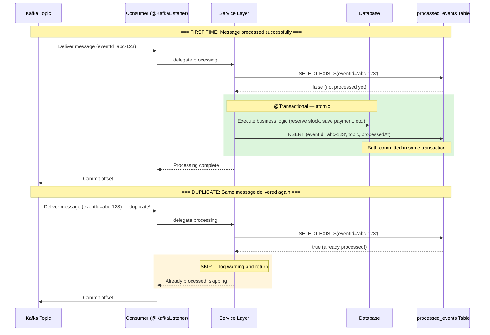
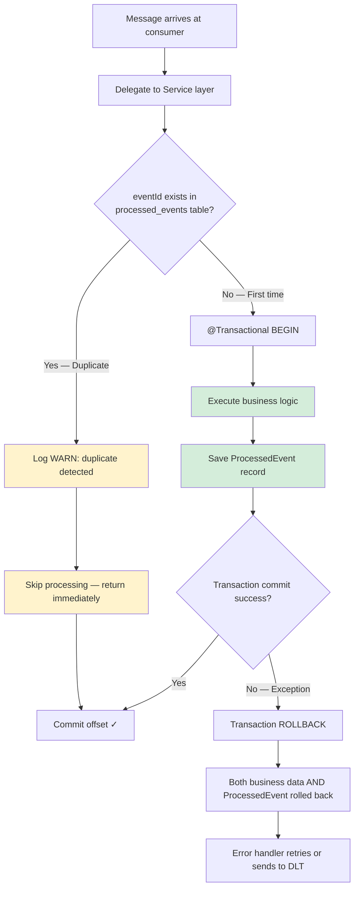
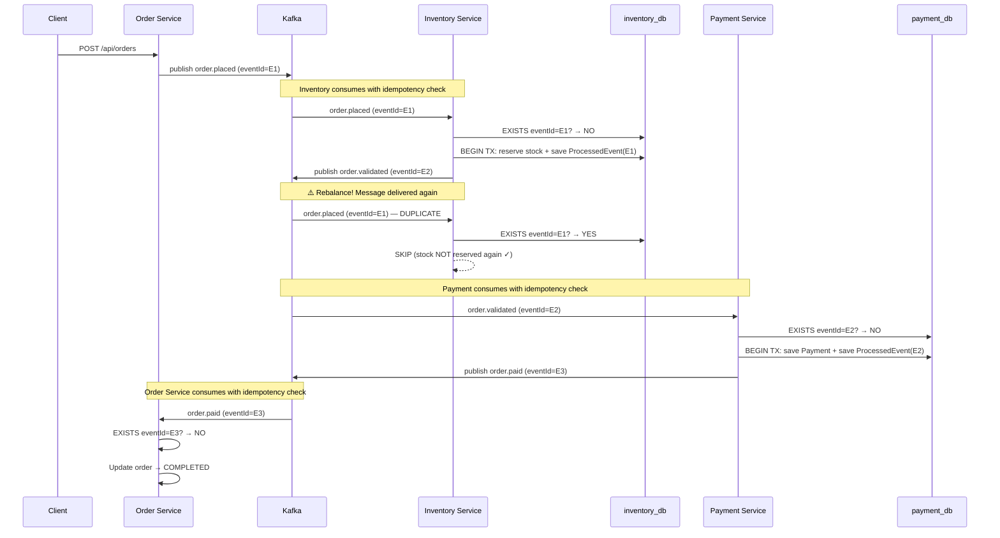
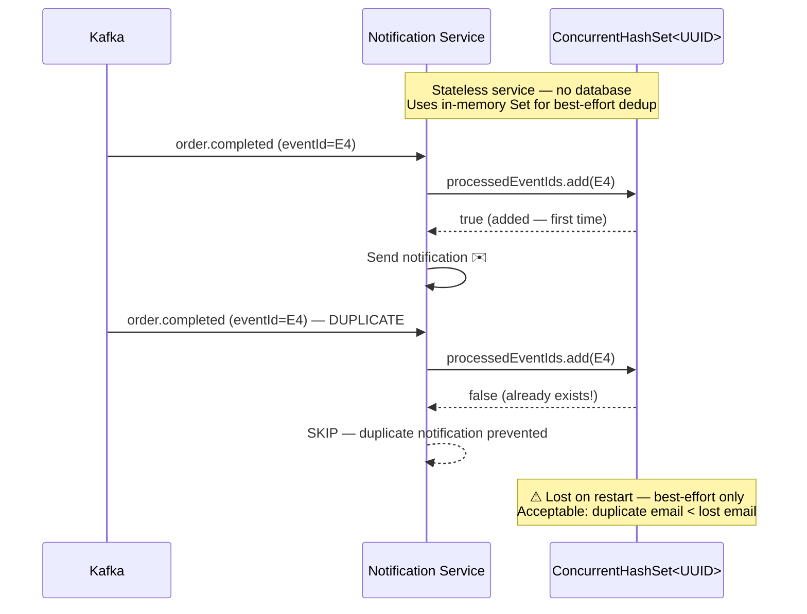

# Step 6: Idempotency & Exactly-Once Semantics — Diagrams

## Vấn đề: Duplicate Message Delivery

Kafka guarantees **at-least-once** delivery. Consumer có thể nhận cùng 1 message nhiều lần khi:
- Consumer rebalance (new consumer join/leave group)
- Consumer crash trước khi commit offset
- Network issue giữa consumer và broker
- Retry từ error handler (Step 5)

**Hậu quả nếu không có idempotency:**
- Inventory Service: reserve stock 2 lần → stock bị trừ gấp đôi
- Payment Service: charge customer 2 lần → mất tiền oan
- Order Service: update status nhiều lần (có thể override trạng thái mới hơn)

## Idempotent Consumer Pattern



## Idempotent Consumer — Decision Flow



## ProcessedEvent Table Schema

```
┌─────────────────────────────────────────────────────┐
│                  processed_events                     │
├──────────────┬──────────┬────────────────────────────┤
│ Column       │ Type     │ Description                │
├──────────────┼──────────┼────────────────────────────┤
│ event_id     │ UUID     │ PK — from OrderEvent.eventId│
│ topic        │ VARCHAR  │ Source Kafka topic          │
│ processed_at │ TIMESTAMP│ When event was processed   │
└──────────────┴──────────┴────────────────────────────┘

Exists in: order_db, inventory_db, payment_db
(notification-service uses in-memory Set — stateless)
```

## WHY eventId as Primary Key?

```
OrderEvent {
    eventId: UUID ← unique per event, generated by factory method
    orderId: UUID ← same orderId appears in multiple events
    ...
}

Scenario: Order #42 goes through the saga
├── order.placed    → eventId=aaa  orderId=42
├── order.validated → eventId=bbb  orderId=42
├── order.paid      → eventId=ccc  orderId=42
└── order.completed → eventId=ddd  orderId=42

→ Mỗi event có eventId riêng, dù cùng orderId.
→ Dùng eventId (not orderId) để detect exact duplicate delivery.
```

## End-to-End Flow với Idempotency



## Notification Service — In-Memory Deduplication



## Exactly-Once Semantics (EOS) — Kafka Producer

```
Kafka Producer đã được config từ Step 2:

  spring.kafka.producer:
    acks: all                      ← Wait all replicas acknowledge
    properties:
      enable.idempotence: true     ← Broker deduplicates by producer PID + sequence number

┌─────────────────────────────────────────────────────────────┐
│                   Producer Idempotence                        │
│                                                               │
│  Producer ──send(msg, seq=1)──► Broker  (seq=1 saved ✓)     │
│  Producer ──send(msg, seq=1)──► Broker  (seq=1 duplicate!)  │
│                                          └─ Broker discards  │
│                                                               │
│  → Prevents duplicate messages FROM producer side            │
│  → Already enabled since Step 2 (enable.idempotence=true)   │
└─────────────────────────────────────────────────────────────┘
```

## Idempotency Coverage Summary

| Service              | Idempotency Method            | Protected Operations                        |
|----------------------|-------------------------------|---------------------------------------------|
| Order Service        | `processed_events` table (DB) | completeOrder, failOrder, handlePaymentFailure |
| Inventory Service    | `processed_events` table (DB) | processOrderPlaced, compensateReservation    |
| Payment Service      | `processed_events` table (DB) | processOrderValidated                        |
| Notification Service | In-memory `Set<UUID>`         | All notification methods (best-effort)       |
| Kafka Producer       | `enable.idempotence=true`     | Prevents duplicate publish from producer     |

## Key Concepts Learned

| Concept                      | Description                                              |
|------------------------------|----------------------------------------------------------|
| At-Least-Once Delivery       | Kafka default — consumer may receive same message 2+ times |
| Idempotent Consumer          | Processing same message multiple times = same result      |
| ProcessedEvent Table         | DB-based deduplication — eventId as primary key           |
| Atomic Deduplication         | Check + process + save in same @Transactional             |
| Producer Idempotence         | Broker deduplicates by PID + sequence number              |
| Best-Effort Dedup            | In-memory set for stateless services (lost on restart)    |
