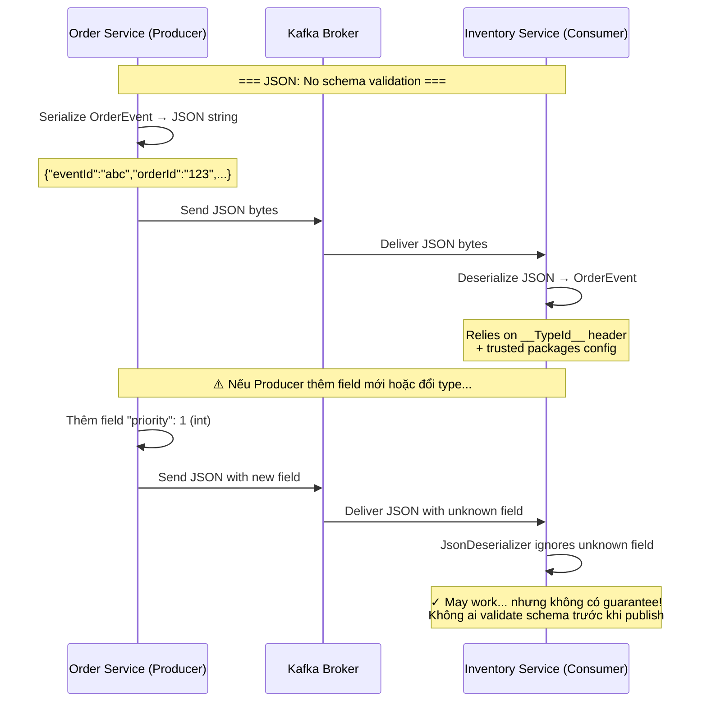
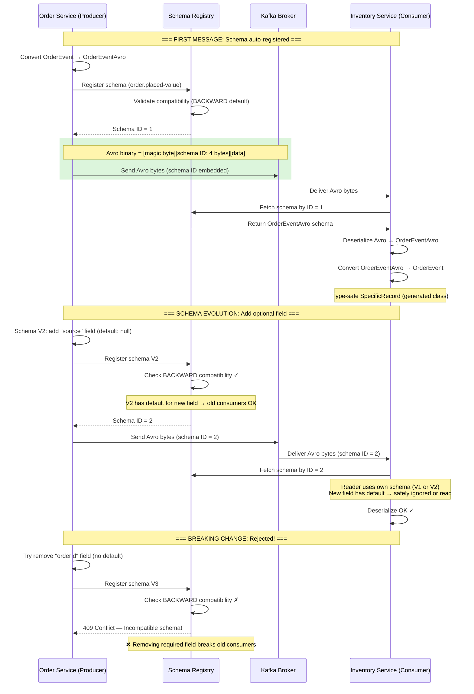
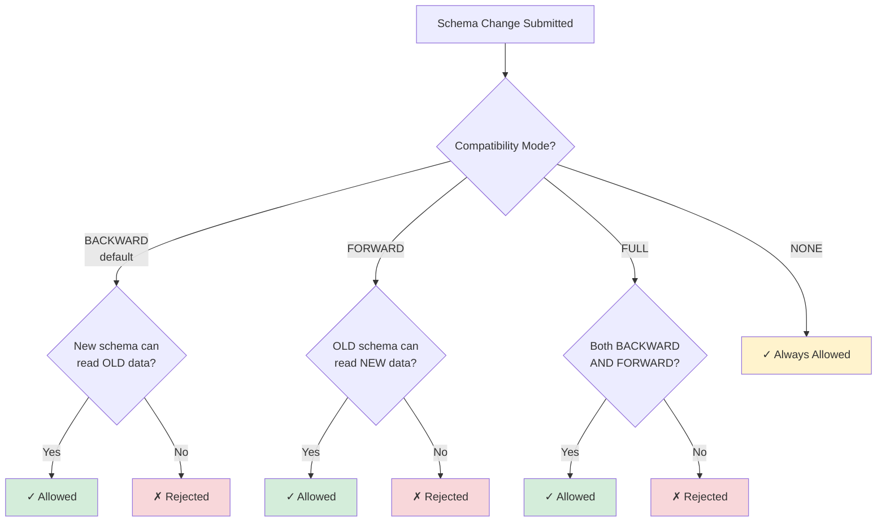
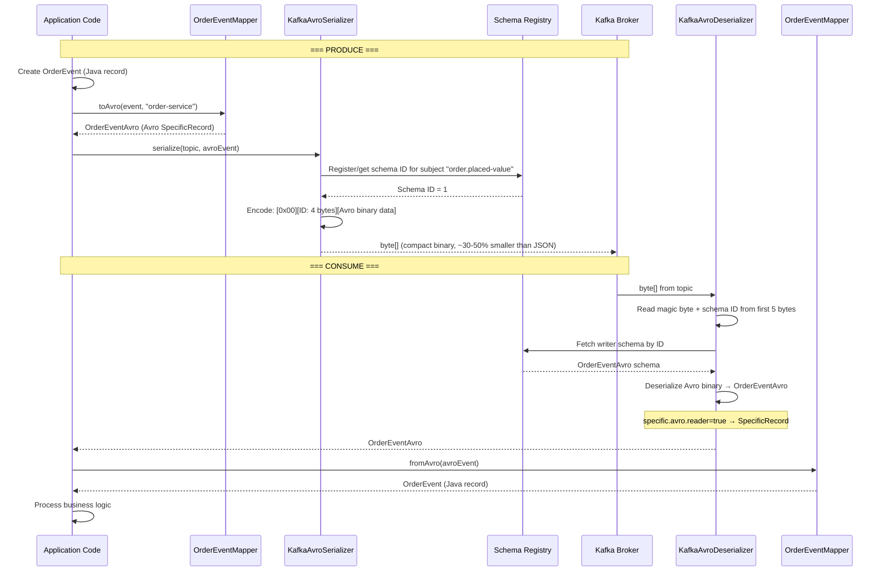
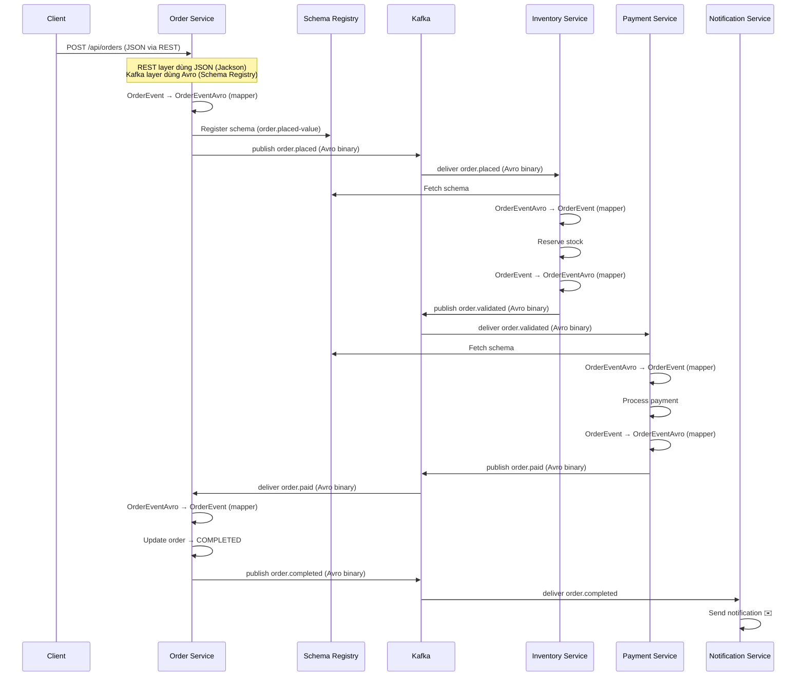

# Step 7: Schema Evolution & Contract Management — Diagrams

## Vấn đề: Schema Drift & Breaking Changes

Khi các service evolve độc lập, schema Kafka message có thể bị "drift":
- Producer thêm field mới → consumer không hiểu
- Producer xóa field → consumer crash vì expect field đó
- Producer đổi type (string → int) → deserialization fail
- Không có formal contract → mỗi team assume khác nhau

**Hậu quả nếu không có Schema Management:**
- Consumer crash khi gặp message format mới
- Data corruption do type mismatch
- Rollback khó vì old/new messages trộn lẫn trong topic
- Không biết service nào dùng schema version nào

## Before: JSON Serialization (No Schema Enforcement)



## After: Avro + Schema Registry (Enforced Contract)



## Schema Registry — Compatibility Modes



## BACKWARD Compatible Changes (Allowed)

```
✓ ADD optional field với default value
  → Old consumer ignore field mới, dùng default

✓ ADD new enum symbol ở cuối
  → Old consumer có thể nhận value mới (cần handle unknown)

✗ REMOVE field đang tồn tại (không có default)
  → Old consumer expect field, crash khi không tìm thấy

✗ CHANGE field type (string → int)
  → Deserialization fail

✗ RENAME field
  → Avro dùng field name để match, rename = remove + add
```

## Avro Serialization Flow



## OrderEventMapper — Bridge giữa Business và Kafka Layer

```mermaid
flowchart LR
    subgraph "Business Layer"
        OE[OrderEvent<br/>Java record]
        OS[OrderService]
    end

    subgraph "Kafka Layer"
        OEA[OrderEventAvro<br/>Avro SpecificRecord]
        KP[KafkaProducer]
        KC[KafkaConsumer]
    end

    subgraph "Infrastructure"
        SR[Schema Registry]
        KB[Kafka Broker]
    end

    OS -->|create| OE
    OE -->|toAvro()| OEA
    OEA -->|serialize| KP
    KP -->|publish| KB
    KP -.->|register schema| SR

    KB -->|deliver| KC
    KC -.->|fetch schema| SR
    KC -->|deserialize| OEA
    OEA -->|fromAvro()| OE
    OE -->|delegate| OS

    style OE fill:#d4edda
    style OEA fill:#cce5ff
    style SR fill:#fff3cd
```

## Schema Subject Naming Strategy

```
Topic Name Strategy (default):
  subject = <topic>-value

┌──────────────────┬──────────────────────────┐
│ Topic            │ Schema Subject           │
├──────────────────┼──────────────────────────┤
│ order.placed     │ order.placed-value       │
│ order.validated  │ order.validated-value    │
│ order.paid       │ order.paid-value         │
│ order.completed  │ order.completed-value    │
│ order.failed     │ order.failed-value       │
│ payment.failed   │ payment.failed-value     │
└──────────────────┴──────────────────────────┘

Tất cả topics dùng cùng schema (OrderEventAvro),
nhưng Schema Registry track version riêng per subject.
→ Có thể set compatibility mode khác nhau per topic.
```

## Avro Schema Definition

```json
{
  "type": "record",
  "name": "OrderEventAvro",
  "namespace": "dnc.cuong.common.avro",
  "fields": [
    {"name": "eventId",       "type": "string"},
    {"name": "orderId",       "type": "string"},
    {"name": "customerId",    "type": "string"},
    {"name": "items",         "type": {"type": "array", "items": "OrderItemAvro"}},
    {"name": "totalAmount",   "type": "string"},
    {"name": "status",        "type": "OrderStatusAvro"},
    {"name": "reason",        "type": ["null", "string"],  "default": null},
    {"name": "createdAt",     "type": "string"},
    {"name": "schemaVersion", "type": "int",               "default": 1},
    {"name": "source",        "type": ["null", "string"],  "default": null}
  ]
}

Schema evolution: schemaVersion và source có default values
→ BACKWARD compatible: consumer dùng schema cũ vẫn đọc được
→ Nếu consumer chưa biết field "source" → Avro tự skip
```

## End-to-End Flow với Avro + Schema Registry



## Infrastructure Overview

```
┌─────────────────────────────────────────────────┐
│                  Docker Compose                    │
├─────────────────────────────────────────────────┤
│                                                    │
│  ┌──────────────┐  ┌────────────────────────┐    │
│  │ Kafka 4.0.0   │  │ Schema Registry 7.7.1  │    │
│  │ (KRaft mode)  │  │ Port: 8085 (host)      │    │
│  │ Port: 9094    │  │ Stores schemas in      │    │
│  │               │←─│ _schemas topic         │    │
│  └──────────────┘  └────────────────────────┘    │
│         ↑                    ↑                     │
│         │                    │                     │
│  ┌──────────────┐            │                     │
│  │ Kafka UI      │  ← reads schemas               │
│  │ Port: 8088    │                                 │
│  └──────────────┘                                 │
│                                                    │
│  ┌──────────────┐                                 │
│  │ PostgreSQL 16 │  order_db, inventory_db,       │
│  │ Port: 5432    │  payment_db                    │
│  └──────────────┘                                 │
└─────────────────────────────────────────────────┘

Spring Boot Services (run on host):
  Order Service      :8081 ──→ Kafka + Schema Registry
  Inventory Service  :8082 ──→ Kafka + Schema Registry
  Payment Service    :8083 ──→ Kafka + Schema Registry
  Notification Service :8084 ──→ Kafka + Schema Registry
```

## Key Concepts Learned

| Concept                         | Description                                                    |
|---------------------------------|----------------------------------------------------------------|
| Schema Registry                 | Centralized service quản lý và validate schema versions        |
| Avro Serialization              | Binary format, compact, schema embedded by ID in message       |
| SpecificRecord                  | Avro generated Java class — type-safe, có getter/setter        |
| GenericRecord                   | Alternative — access field by name (string), less type-safe    |
| BACKWARD Compatibility          | New schema can read old data (default mode)                    |
| FORWARD Compatibility           | Old schema can read new data                                   |
| FULL Compatibility              | Both BACKWARD and FORWARD                                      |
| Schema Subject                  | `<topic>-value` — tracks versions per topic                    |
| TopicNameStrategy               | Default naming: subject = topic name + "-key"/"-value"         |
| OrderEventMapper                | Bridge between business layer (record) and Kafka layer (Avro)  |
| Schema Evolution                | Add optional fields with defaults → safe, enforced by registry |
| Producer Idempotence + Avro     | `enable.idempotence=true` + Avro = exactly-once + schema safe  |

## Useful Commands — Schema Registry

```bash
# List all registered subjects
curl http://localhost:8085/subjects

# Get versions for a subject
curl http://localhost:8085/subjects/order.placed-value/versions

# Get latest schema for a subject
curl http://localhost:8085/subjects/order.placed-value/versions/latest

# Check compatibility of a new schema
curl -X POST http://localhost:8085/compatibility/subjects/order.placed-value/versions/latest \
  -H "Content-Type: application/vnd.schemaregistry.v1+json" \
  -d '{"schema": "{...}"}'

# Get global compatibility level
curl http://localhost:8085/config

# Set compatibility level for a subject
curl -X PUT http://localhost:8085/config/order.placed-value \
  -H "Content-Type: application/vnd.schemaregistry.v1+json" \
  -d '{"compatibility": "FULL"}'
```
