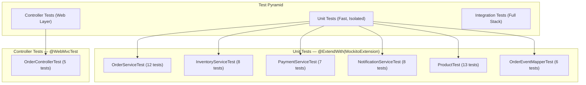
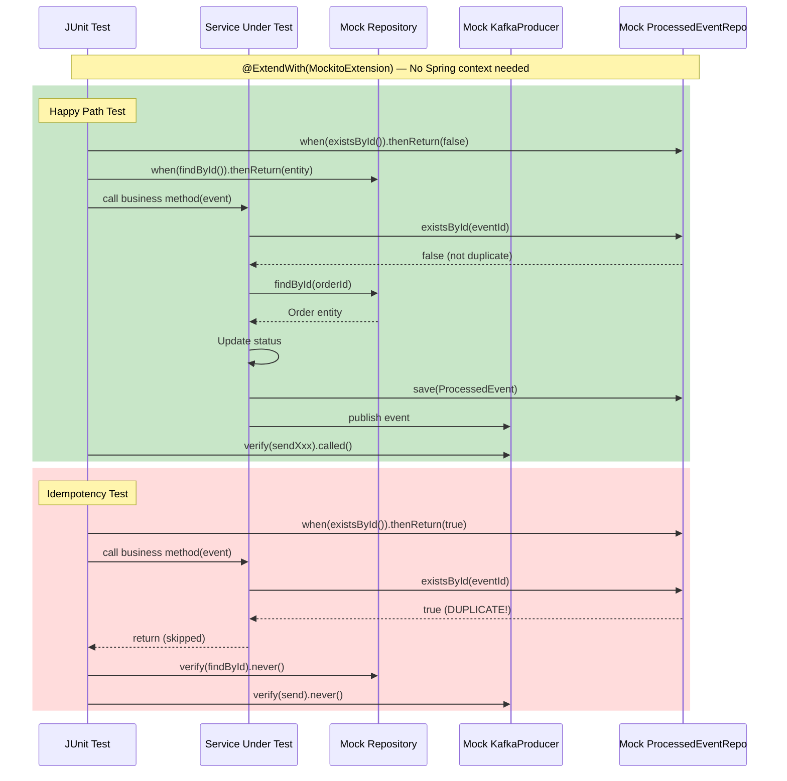
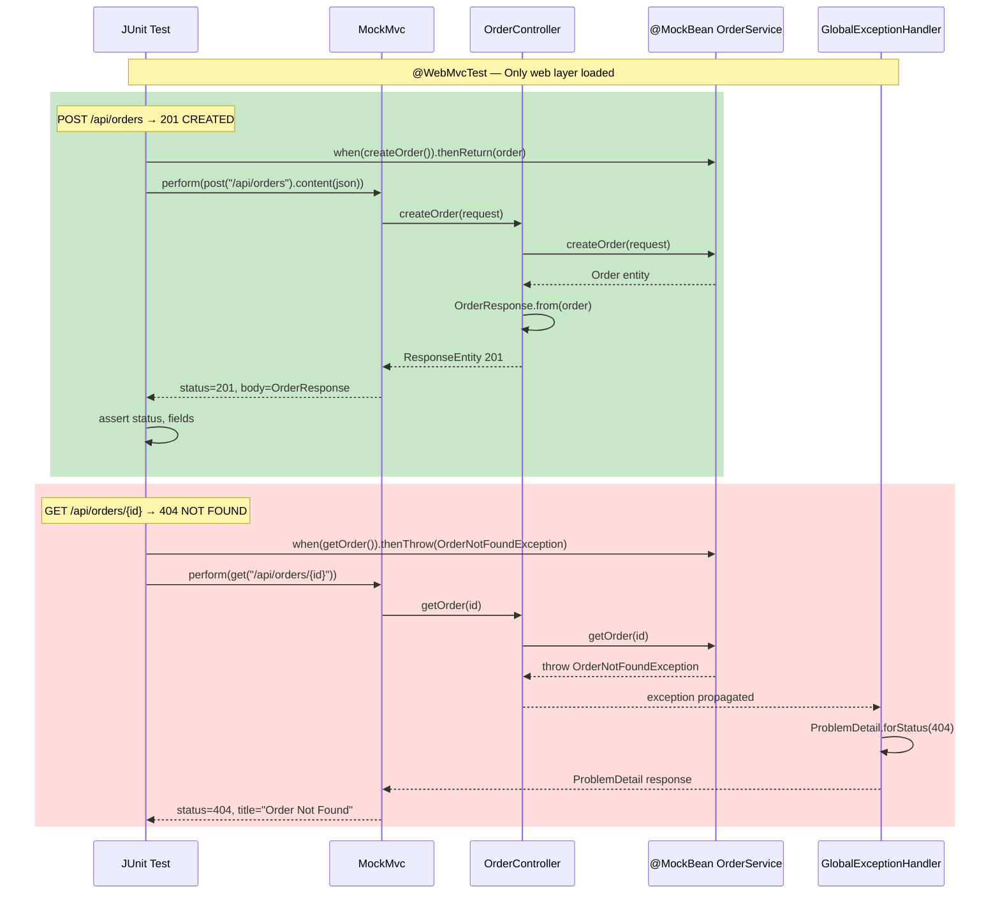
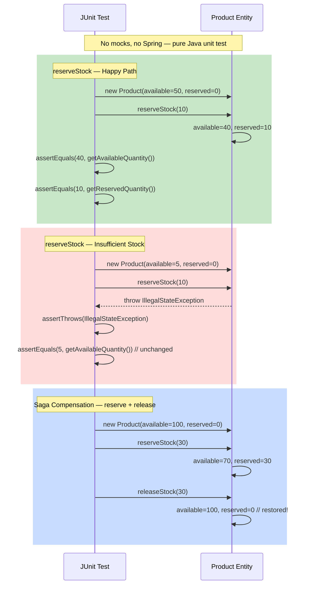
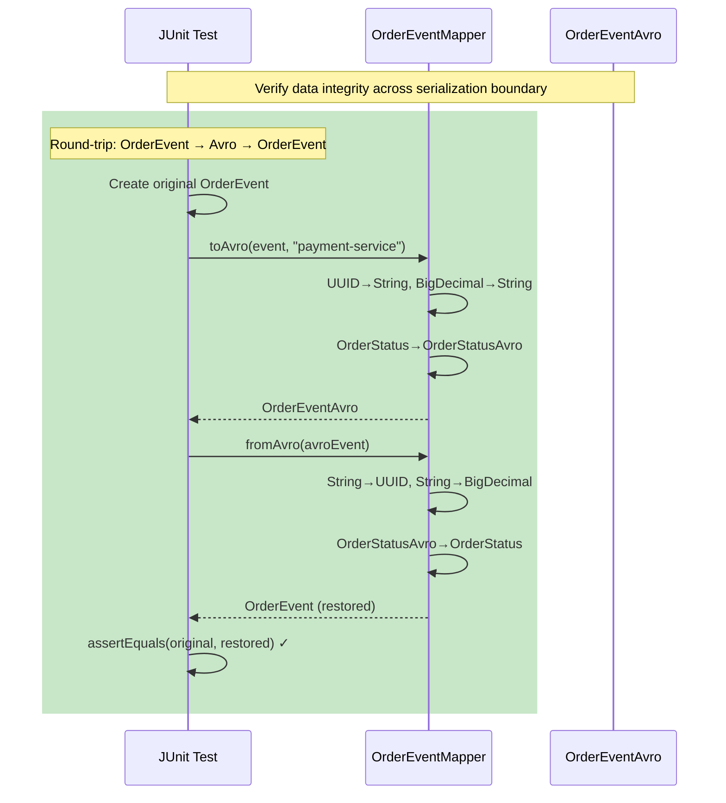
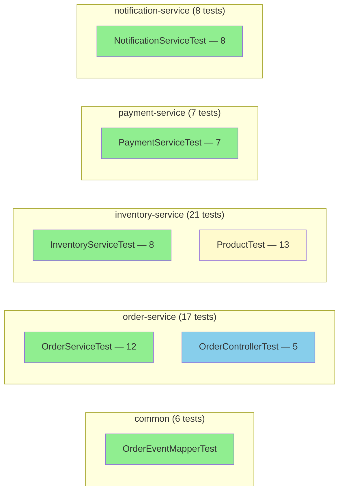

# Step 8: Testing — Sequence Diagrams

## 1. Testing Strategy Overview

## 2. Unit Test Flow — Service Layer (Mockito)

## 3. Controller Test Flow — MockMvc

## 4. Domain Logic Test Flow — Pure Unit Test

## 5. Avro Mapper Test Flow — Round-trip Verification

## 6. Test Coverage Summary

| Color | Test Type | Total |
|-------|-----------|-------|
| Green | Service Unit Tests (Mockito) | 35 |
| Blue | Controller Tests (MockMvc) | 5 |
| Yellow | Domain Logic Tests (Pure) | 13 |
| **Total** | | **59** |
