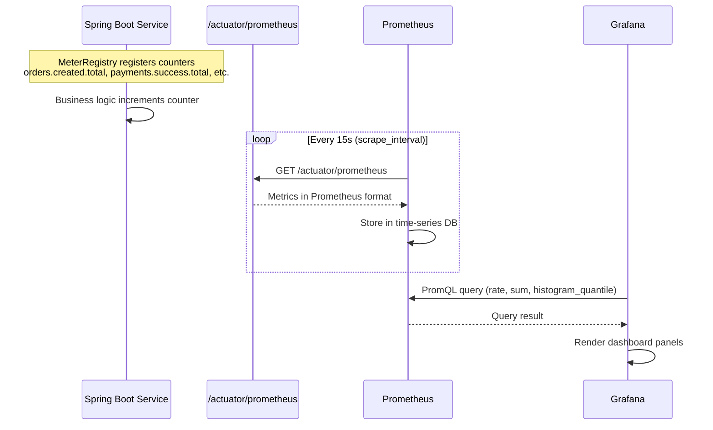
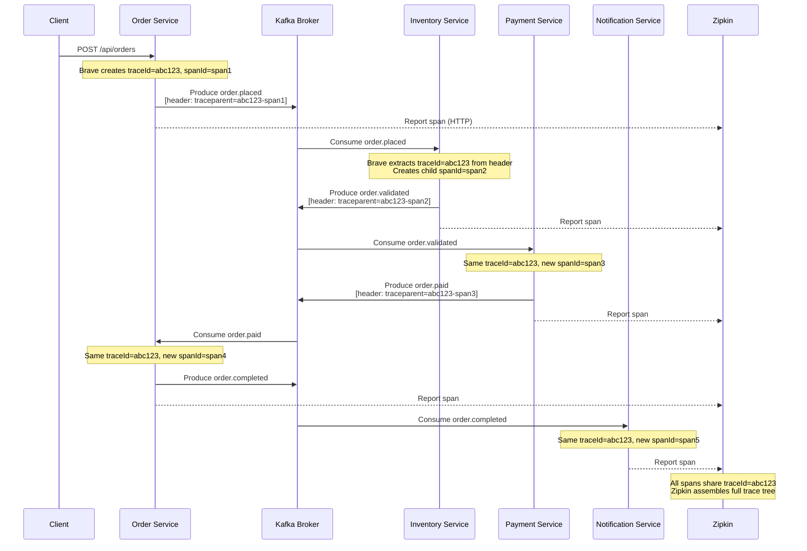
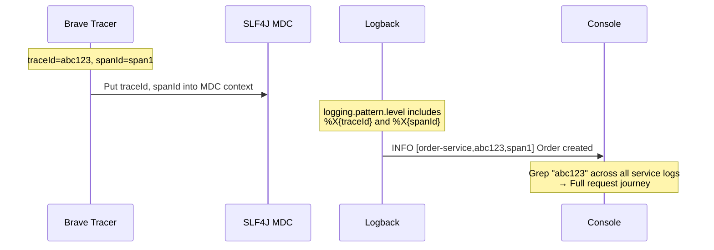
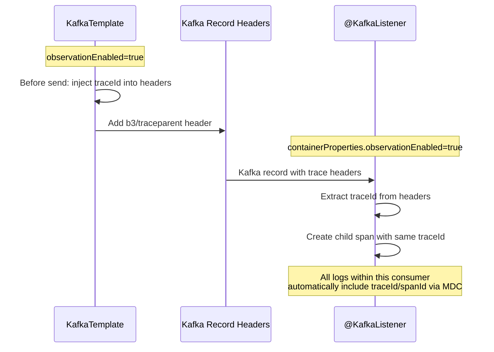
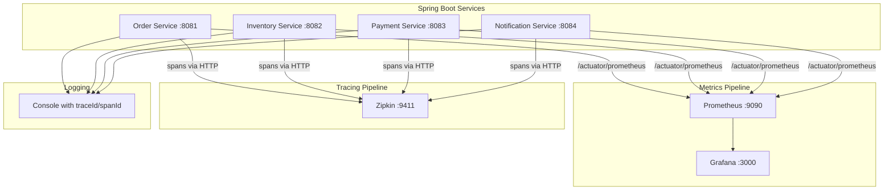

# Step 9: Observability — Sequence Diagrams

## 1. Metrics Flow (Prometheus + Grafana)

## 2. Distributed Tracing Flow (Brave + Zipkin)

## 3. Structured Logging Flow (MDC)

## 4. Kafka Observation (Trace Propagation)

## 5. Full Observability Stack

